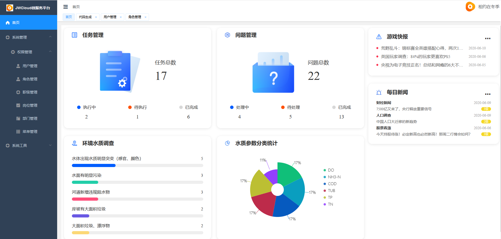
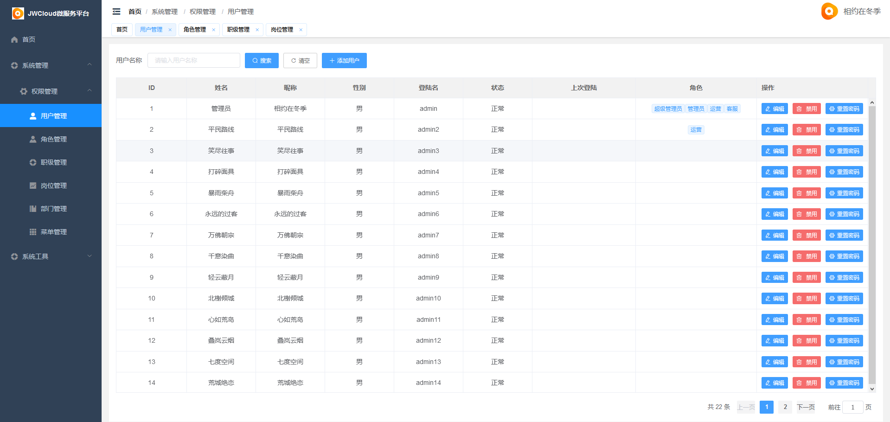
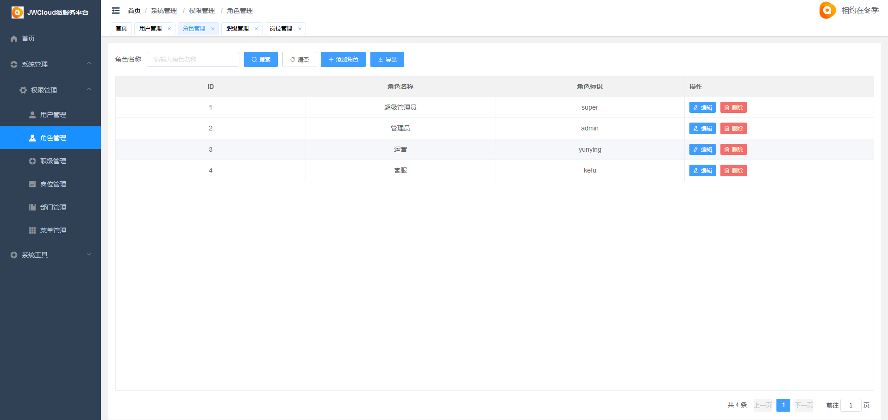
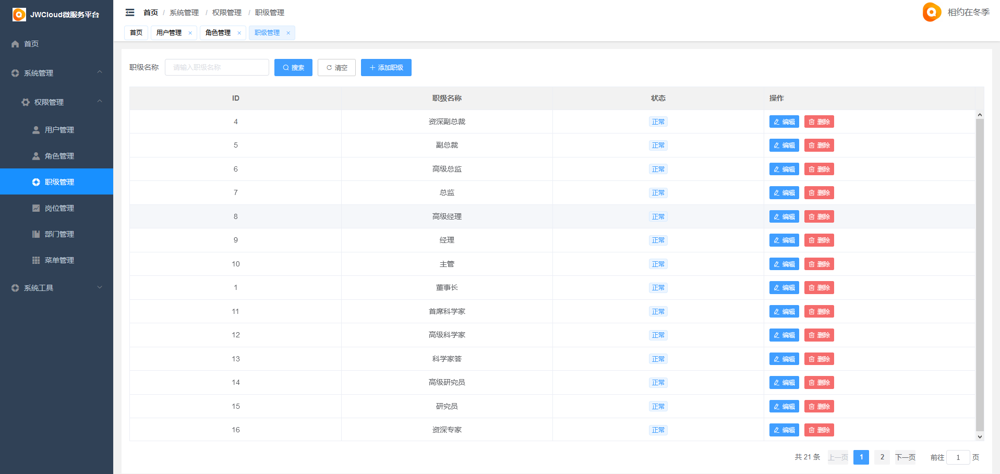
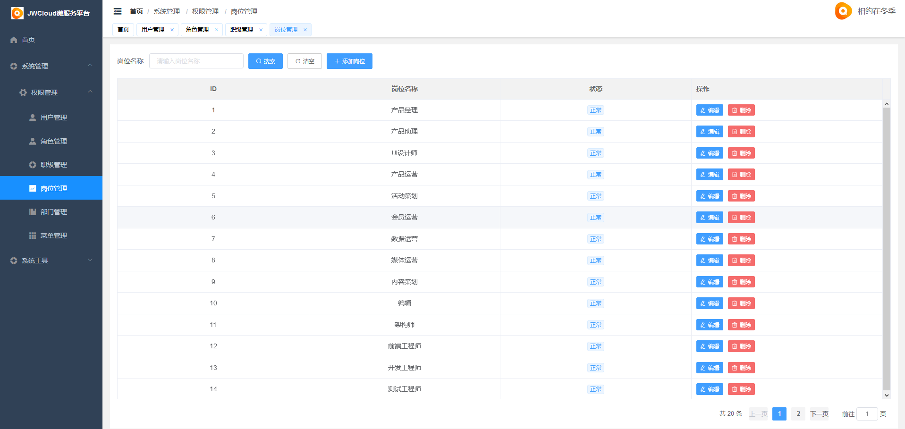
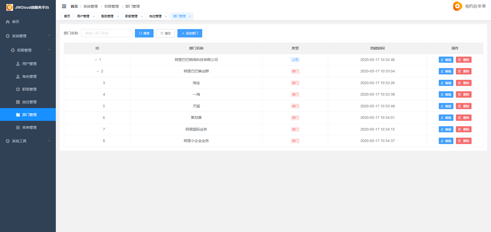
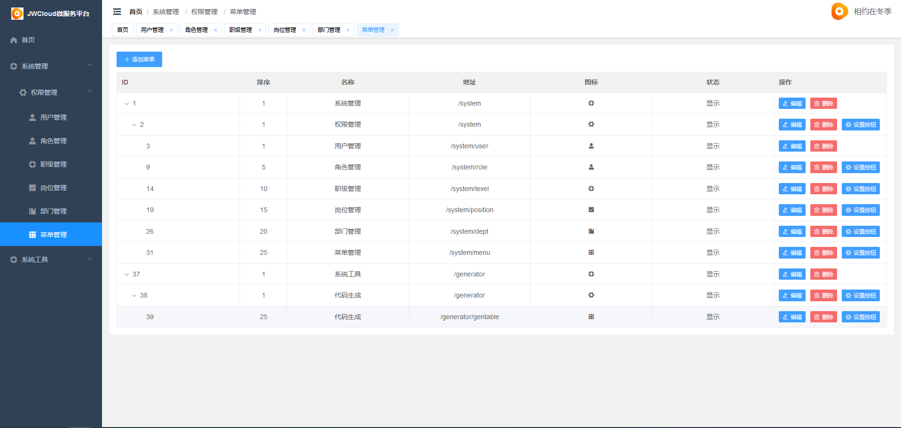
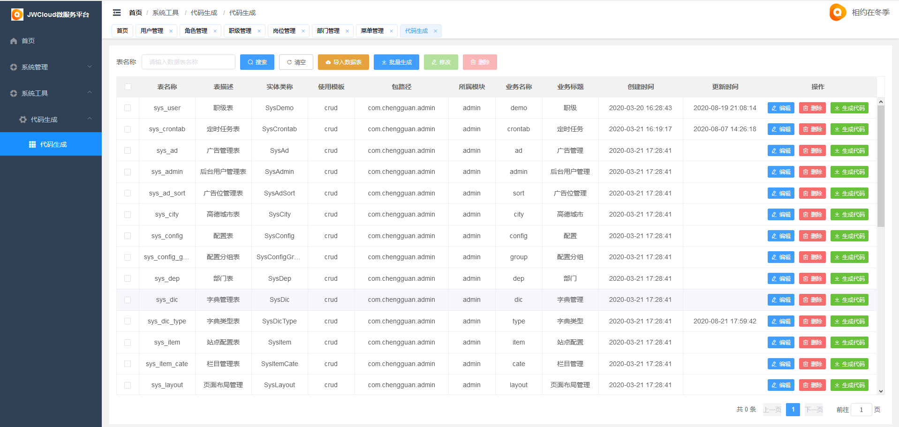
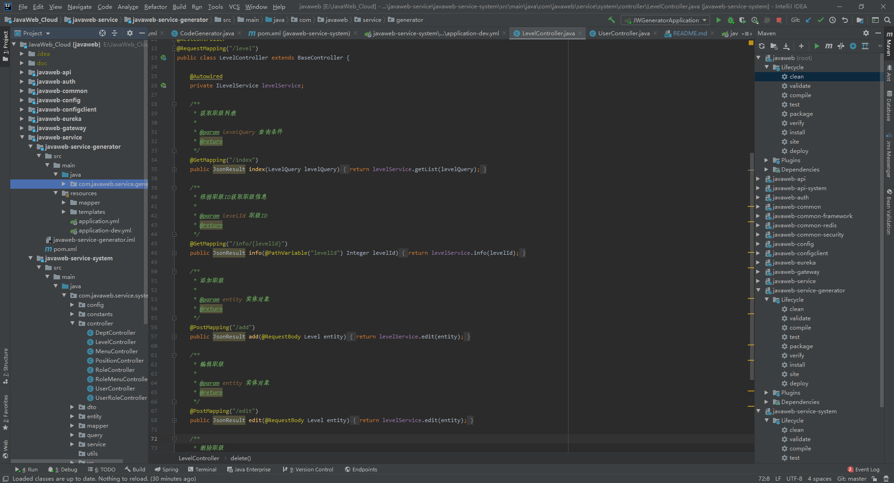

## 📚 项目介绍
一款 Java 语言基于 SpringCloud、Vue、ElementUI、MySQL等框架精心打造的一款前后端分离框架，致力于实现模块化、组件化、可插拔的前后端分离架构敏捷开发框架，可用于快速搭建前后端分离后台管理系统，本着简化开发、提升开发效率的初衷，目前框架已集成了完整的RBAC权限架构和常规基础模块，前端Vue端支持多主题切换，可以根据自己喜欢的风格选择想一个的主题，实现了个性化呈现的需求；

为了敏捷快速开发，提升研发效率，框架内置了一键CRUD代码生成器，自定义了模块生成模板，可以根据已建好的表结构(字段注释需规范)快速的一键生成整个模块的所有代码和增删改查等等功能业务，真正实现了低代码开发，极大的节省了人力成本的同时提高了开发效率，缩短了研发周期，是一款真正意义上实现组件化、低代码敏捷开发框架。

## 🍪 内置模块
+ 用户管理：用于维护管理系统的用户，常规信息的维护与账号设置。
+ 角色管理：角色菜单管理与权限分配、设置角色所拥有的菜单权限。
+ 菜单管理：配置系统菜单，操作权限，按钮权限标识等。
+ 职级管理：主要管理用户担任的职级。
+ 岗位管理：主要管理用户担任的岗位。
+ 部门管理：主要管理系统组织架构，对组织架构进行统一管理维护。
+ 操作日志：系统正常操作日志记录和查询；系统异常信息日志记录和查询。
+ 登录日志：系统登录日志记录查询包含登录异常。
+ 代码生成：一键生成模块CRUD的功能，包括后端和前端Vue等相关代码。
+ 案例演示：常规代码生成器一键生成后的演示案例。

## 👷 开发者信息
+ 系统名称：JavaWeb_Cloud微服务框架专业版
+ 软件作者：@鲲鹏
+ 软件出处：上海JavaWeb研发中心
+ 软件咨询：[1451478873](http://wpa.qq.com/msgrd?v=3&amp;uin=1451478873&amp;site=qq&amp;menu=yes)
+ 官网网址：[http://www.javaweb.vip](http://www.javaweb.vip)  
+ 文档网址：[http://docs.cloud.javaweb.vip](http://docs.cloud.javaweb.vip)  
+ 开源协议：LGPL-3.0

## 🎨 系统演示

演示地址：http://manage.cloud.javaweb.vip

账号 | 密码| 操作权限
---|---|---
admin | 123456| 演示环境无法进行修改删除操作

## 👷 技术支持

[技术支持QQ：1451478873](http://wpa.qq.com/msgrd?v=3&amp;uin=1451478873&amp;site=qq&amp;menu=yes)

## 📌 版本说明

| 版本名称 | 说明 | 地址 |
| :---: | :---: | :---: |
| JavaWeb 混编专业版 | 采用SpringBoot2+Thymeleaf+layui | https://gitee.com/javaweb520/JavaWeb |
| JavaWeb_Pro 混编旗舰版 | 采用SpringBoot2+Thymeleaf+layui | https://gitee.com/javaweb520/JavaWeb_Pro |
| JavaWeb_Vue专业版 | 前后端分离版，采用SpringBoot2+Vue+ElementUI | https://gitee.com/javaweb520/JavaWeb_Vue |
| JavaWeb_Vue_Pro旗舰版 | 采用SpringBoot2+Vue+ElementUI | https://gitee.com/javaweb520/JavaWeb_Vue_Pro |
| JavaWeb_Ant_Pro旗舰版 | 采用SpringBoot2+Vue+AntDesign | https://gitee.com/javaweb520/JavaWeb_Ant_Pro |
| JavaWeb_Cloud微服务专业版 | 采用SpringCloud+Vue+ElementUI | https://gitee.com/javaweb520/JavaWeb_Cloud |
| JavaWeb_Cloud_Pro微服务旗舰版 | 采用SpringCloud+Vue+ElementUI | https://gitee.com/javaweb520/JavaWeb_Cloud_Pro |
| JavaWeb_Cloud_Ant微服务旗舰版 | 采用SpringCloud+Vue+AntDesign | https://gitee.com/javaweb520/JavaWeb_Cloud_Ant |

## 🔧 模块展示

## 🍻 贡献者名单

@鲲鹏

## 🍻  安全&缺陷
如果你发现了一个安全漏洞或缺陷，请发送邮件到 1451478873@qq.com,所有的安全漏洞都将及时得到解决。

## ✨  特别鸣谢
感谢[MybatisPlus](https://mp.baomidou.com/)、[VueJs](https://cn.vuejs.org/)、[ElementUI](https://element.eleme.cn/#/zh-CN)等优秀开源项目。

## 📚 版权信息

软件版权和最终解释权归JavaWeb研发团队所有，商业版使用需授权，未授权禁止恶意传播和用于商业用途，否则将追究相关人的法律责任。

本项目包含的第三方源码和二进制文件之版权信息另行标注。

版权所有Copyright © 2021 [javaweb.vip](http://www.javaweb.vip) All rights reserved。

更多细节参阅 [LICENSE](LICENSE)